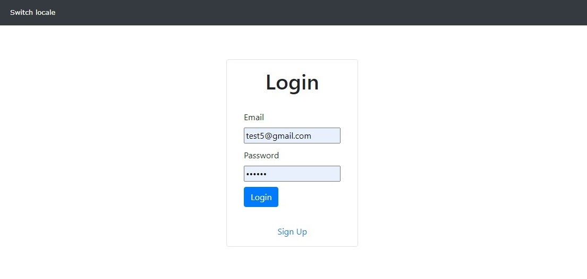
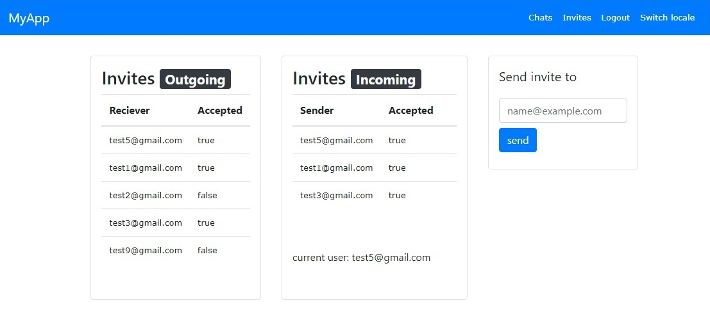
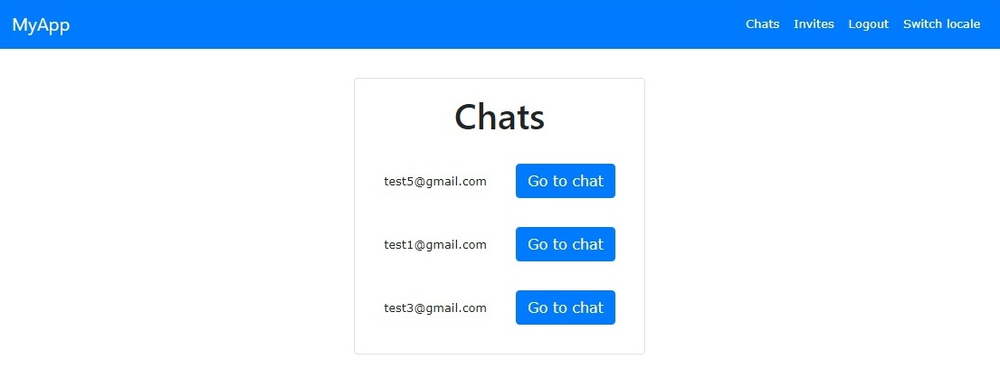

# Chat on rails

## Функциональность и архитектура

Веб-приложение представляет из себя чат с ситемой приглашений, реализованный на Ruby on rails. Аутентификационные данные, приглашения и сообщения сохраняются в БД Sqlite.

## Скриншоты

